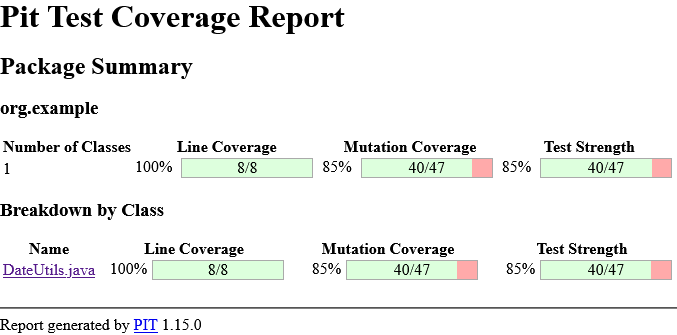
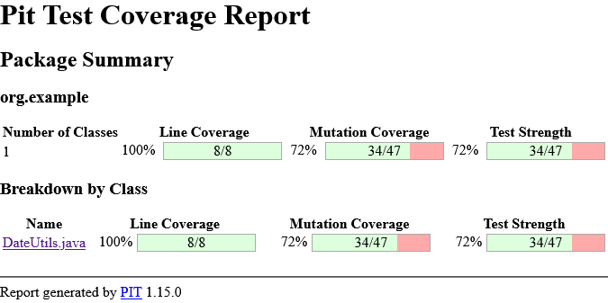

# Análise de Testes: SBST (EvoSuite) vs. LLM (IA Generativa)

Este projeto realiza uma comparação técnica entre a geração de testes baseada em busca (EvoSuite) e a geração assistida por IA (LLM) para a classe `DateUtils.java`.

---

## 📊 Resultados de Mutação (PITest)

Após a refatoração e organização dos pacotes, os resultados finais de Mutation Coverage foram:

| Ferramenta | Cobertura de Mutação | Testes Gerados | Estilo de Teste |
| :--- | :---: | :---: | :--- |
| **EvoSuite (SBST)** | **85%** | 26 | Caixa-preta / Aleatório |
| **LLM (ChatGPT)** | **72%** | 4 | Semântico / Legível |

---

## 📂 Estrutura do Repositório

O projeto está organizado seguindo as normas do Maven:
* `src/main/java/org/example/`: Código fonte original.
* `src/test/java/org/example/evosuite/`: Suíte gerada pelo EvoSuite (85% de eficácia).
* `src/test/java/org/example/llm/`: Suíte gerada por LLM (72% de eficácia).
* `reports/`: Relatórios HTML detalhados do PITest.

---

## 📝 Como visualizar os relatórios

Os relatórios completos de mutação estão disponíveis na pasta `/reports`.

* **Relatório EvoSuite (85%)**
  [Acesse o HTML aqui](./reports/evosuite/org.example/DateUtils.java.html)

  

* **Relatório LLM (72%)**
  [Acesse o HTML aqui](./reports/llm/org.example/DateUtils.java.html)

  